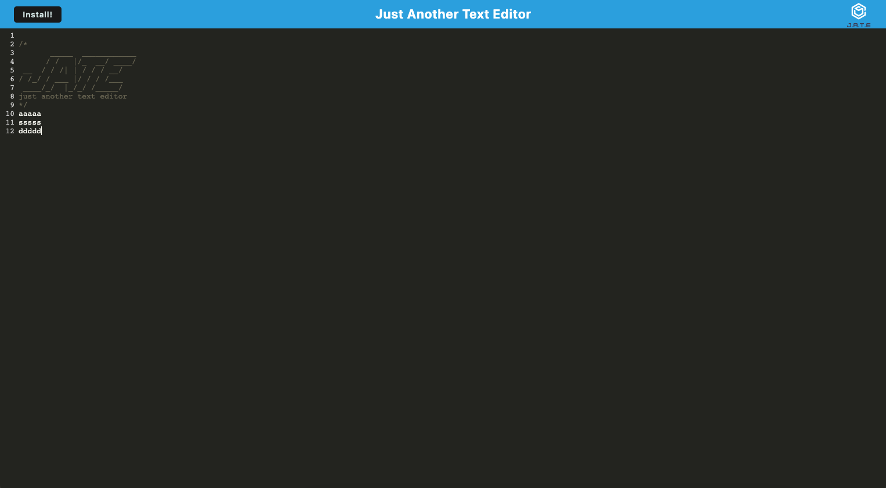

# Text Editor
[Link to Deployed Website](https://text-editor-pwa-ng.herokuapp.com/)

## Description
The project was built to be able to create a text editor that meets the PWA criteria. The text editor allows users to create notes or code snippets with or without an internet connection. When the text editor is opened, IndexDB creates a database storage and content entered into the text editor is saved with IndexedDB. The web application can be downloaded when the install button is clicked.

## Technologies Used
- JavaScript
- Git
- GitHub
- Express.js
- Webpack
- IndexedDB

## Usage
To download the web application, click the install button. A prompt will apprear to either cancel or install.

## License
Please refer to the LICENSE in the repo.

## Author Links
[GitHub](https://github.com/ncguan)